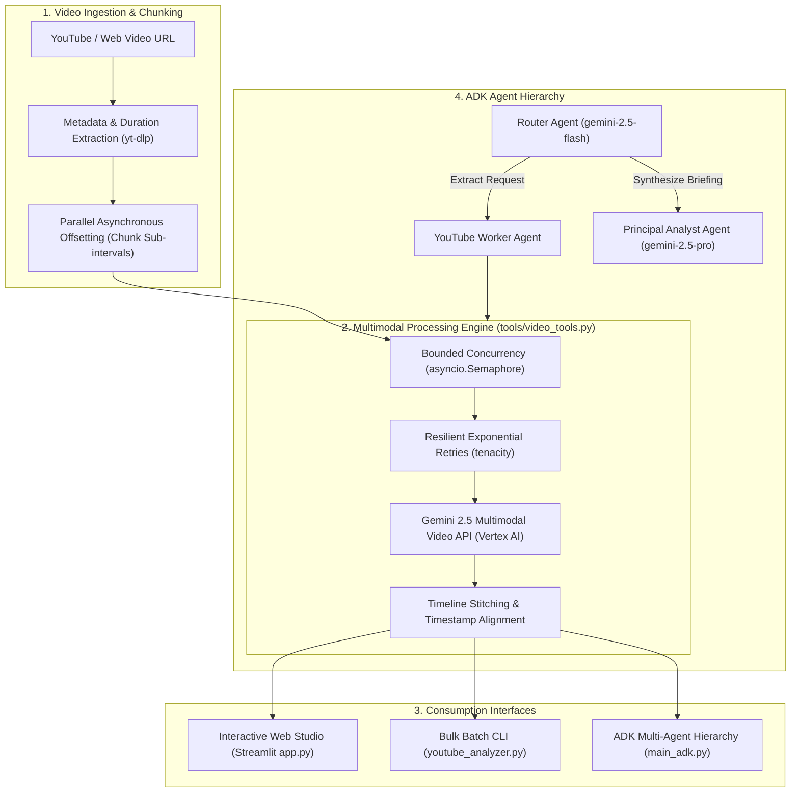

# Enterprise Multimodal Video Intelligence Platform

An enterprise-grade Python solution for extracting deep transcripts, financial & earnings intelligence, multimodal evidence, and executive briefings from video streams using **Google Gemini 2.5 on Vertex AI** and the **Google Agent Development Kit (ADK)**.

---

## 🏛️ System Architecture



---

## 🌟 Key Capabilities

1. **Parallel Asynchronous Offsetting**:
   - Analyzes arbitrarily long videos without hitting token or buffer limits by partitioning into configurable sub-intervals (e.g. 350s or 600s).
   - Processes all intervals concurrently in the cloud, delivering full analysis for 15-minute videos in **under 45 seconds**.
2. **Enterprise Financial & Market Intelligence Template**:
   - **Key Metrics Table**: Reported vs. Consensus revenue, EPS, segment performance, and beat/miss calculations.
   - **Forward Guidance & CapEx Outlook**: Quantified forward guide vs. street expectations and hyperscaler infrastructure spend.
   - **Thematic Drivers**: Deep tracking of supply constraints (HBM, CoWoS packaging, power), geopolitics/export regulations, and enterprise AI ROI.
   - **Direct Executive Quotes**: C-Suite & analyst statements mapped to absolute timeline markers `[MM:SS]`.
3. **Google ADK Multi-Agent Hierarchy**:
   - `router_agent`: Intelligent routing between data extraction and synthesis.
   - `youtube_agent`: Specialized worker leveraging native video tools.
   - `analyst_agent`: Powered by `gemini-2.5-pro` for C-Suite briefings with GitHub-style callouts (`[!NOTE]`, `[!TIP]`, `[!IMPORTANT]`, `[!WARNING]`).
4. **Production Resilience & Rate Limiting**:
   - Bounded concurrency with `asyncio.Semaphore` to prevent 429 quota exhaustion.
   - Exponential backoff retries via `tenacity` on transient network errors.
   - Deterministic low-temperature sampling (`temperature=0.2`) for high-fidelity numerical extraction.
5. **Interactive Web Studio & Side-by-Side Player**:
   - Embedded video playback synchronized with real-time analysis.
   - One-click report downloads in **Markdown (`.md`)** and **Structured JSON (`.json`)**.

---

## 🚀 Quickstart & Setup

### 1. Prerequisites
- **Python 3.10+**
- **Google Cloud Project** with Vertex AI API enabled (`gcloud auth application-default login`)

### 2. Environment Setup

Clone repository and configure dependencies:

```bash
cd yt_analysis

# Create and activate virtual environment
uv venv .venv
source .venv/bin/activate

# Install all dependencies (SDK, ADK, Streamlit, Tenacity)
uv pip install -r requirements-adk.txt
```

### 3. Configure Credentials

Create your `.env` configuration file:

```ini
# Google Cloud Vertex AI Configuration
GOOGLE_GENAI_USE_VERTEXAI=1
GOOGLE_CLOUD_PROJECT=your-gcp-project-id
GOOGLE_CLOUD_LOCATION=global
GOOGLE_ADK_MODEL=gemini-3.7-flash
```

---

## 🖥️ Usage Modes

### Mode 1: Interactive Web Studio (Streamlit)

Launch the interactive web studio featuring side-by-side video playback, unified table post-processing, persistent run history, and instant report downloads:

```bash
streamlit run app.py
```

- Navigate to `http://localhost:8501`.
- Paste any YouTube video URL or select pre-loaded presets.
- Choose your template (**Financial Intelligence**, **Key Takeaways**, **Chapters**, or **Transcript**).
- **Run History**: Automatically caches and lists previous runs in the sidebar for instant recall.
- **Unified Tables**: Post-processed across all chunks into single consolidated metrics & guidance tables.
- Export generated reports to `.md` or structured `.json`.

---

### Mode 2: Interactive ADK Multi-Agent CLI

Run the Google ADK hierarchical agent system for conversational extraction and synthesis:

```bash
python main_adk.py
```

**Example Conversation Flow:**
```text
🤖 Google ADK Agent Hierarchy loaded [Model: gemini-2.5-flash].

You: Extract financial intelligence from https://www.youtube.com/watch?v=3MwxX1ee_gI
Agent is thinking...
router_agent: # Financial & Earnings Intelligence Brief
              | Absolute Timecode | Metric / Segment | Reported Value | Consensus | Beat/Miss |
              | 00:10 | Q4 Revenue | $68.1B | $65.8B | Beat |
              | 00:13 | Q4 EPS | $1.62 | $1.53 | Beat |
              ...

You: Synthesize an executive briefing for our Chief Investment Officer highlighting key risks.
Agent is thinking...
router_agent: > [!IMPORTANT]
              > **Executive Briefing: High-Conviction Takeaways**
              > - **Top & Bottom Line Beat**: Q4 Revenue $68.1B (+3.5% vs consensus).
              > - **Forward Guidance**: Q1 Sales guided at $78.0B vs $72.8B street whisper.
              > 
              > [!WARNING]
              > **Key Risk Factors**:
              > - **Supply Constraints**: Advanced CoWoS packaging running at capacity redlines.
              > - **China Regulatory Headwinds**: No revenue assumed for China data center compute.
```

---

### Mode 3: High-Throughput Bulk Batch Processing (CLI)

Analyze multiple videos from a JSON file or single video from terminal:

```bash
# 1. Financial & Earnings Intelligence (Default)
python youtube_analyzer.py --urls_file youtube_urls.json --template financial

# 2. Extract Chapters & Bookmarks
python youtube_analyzer.py --url "https://www.youtube.com/watch?v=3MwxX1ee_gI" --template chapters

# 3. Multimodal Takeaways & Visual Evidence Table
python youtube_analyzer.py --template insights --chunk_size 300

# 4. Full Line-by-Line Timeline Transcript
python youtube_analyzer.py --template transcript --chunk_size 300
```

#### CLI Parameters

| Flag | Default | Description |
|---|---|---|
| `--urls_file` | `youtube_urls.json` | Path to JSON array of video URLs |
| `--url` | `None` | Direct single YouTube URL to process |
| `--template` | `financial` | Template: `financial`, `insights`, `chapters`, `transcript` |
| `--model` | `gemini-2.5-flash` | Gemini model name (`gemini-3.7-flash`, `gemini-2.5-flash`, `gemini-2.5-pro`) |
| `--chunk_size` | `350` | Video sub-interval duration in seconds |
| `--max_concurrency`| `5` | Maximum concurrent API calls (rate-limit protection) |
| `--output_dir` | `outputs` | Target directory for generated Markdown reports |

---

## 📊 Template Reference

### 1. `financial` (Financial & Earnings Intelligence)
Extracts:
- **KPI Performance Table**: Metrics, reported figures, consensus, and beat/miss status.
- **Guidance & Outlook Table**: Forward guidance and strategic drivers.
- **Thematic Drivers**: Supply chain & CoWoS packaging, China export controls, Hyperscaler CapEx ROI.
- **Direct Quotes**: Verbatim statements paired with clickable timecodes `[MM:SS]`.

### 2. `insights` (Multimodal Evidence)
Extracts:
- Markdown table with `Absolute Timecode`, `Key Takeaway`, and concrete `Visual/Audio Evidence` observed in the video.

### 3. `chapters` (Video Navigation)
Extracts:
- Standard YouTube-style timestamped chapter headings `[MM:SS] Chapter Name: Summary`.

### 4. `transcript` (Verbatim Dialogue)
Extracts:
- Complete timeline transcript with speaker labeling and sentence-boundary preservation.

---

## 🔒 Security & Best Practices

- **Zero API Key Leakage**: Native support for Google Cloud Application Default Credentials (ADC) and IAM service accounts.
- **Rate-Limit Resilience**: Embedded `asyncio.Semaphore` and `tenacity` retry safeguards prevent cloud quota throttling.
- **Deterministic Extraction**: Sampling parameters configured with low temperature (`0.2`) to eliminate hallucination in financial numerical data.
